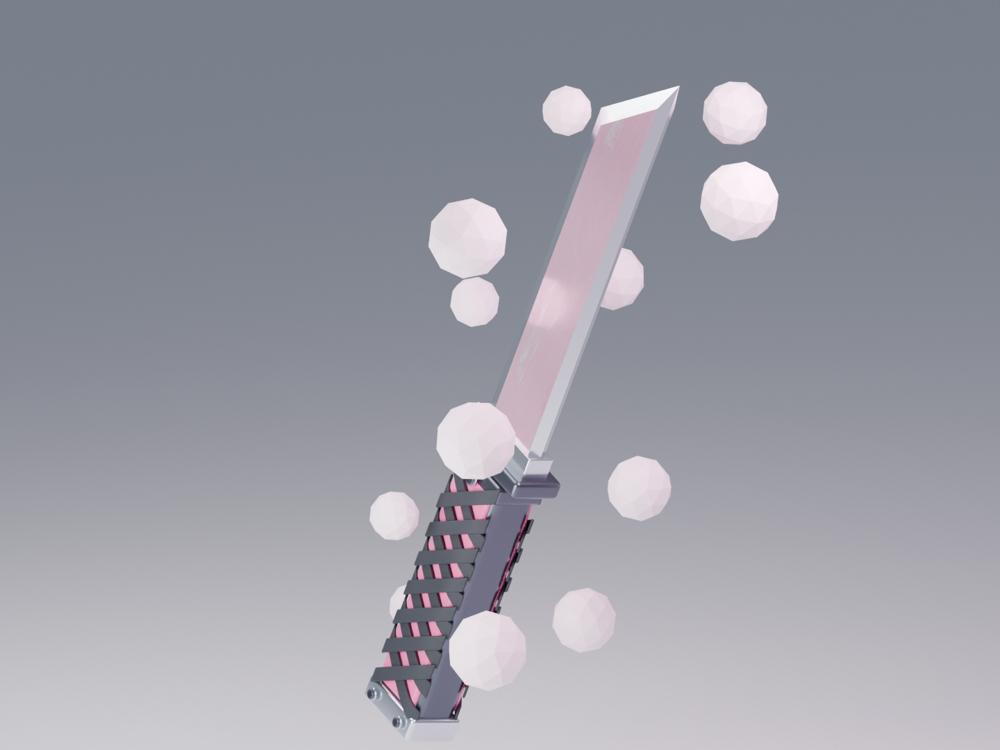
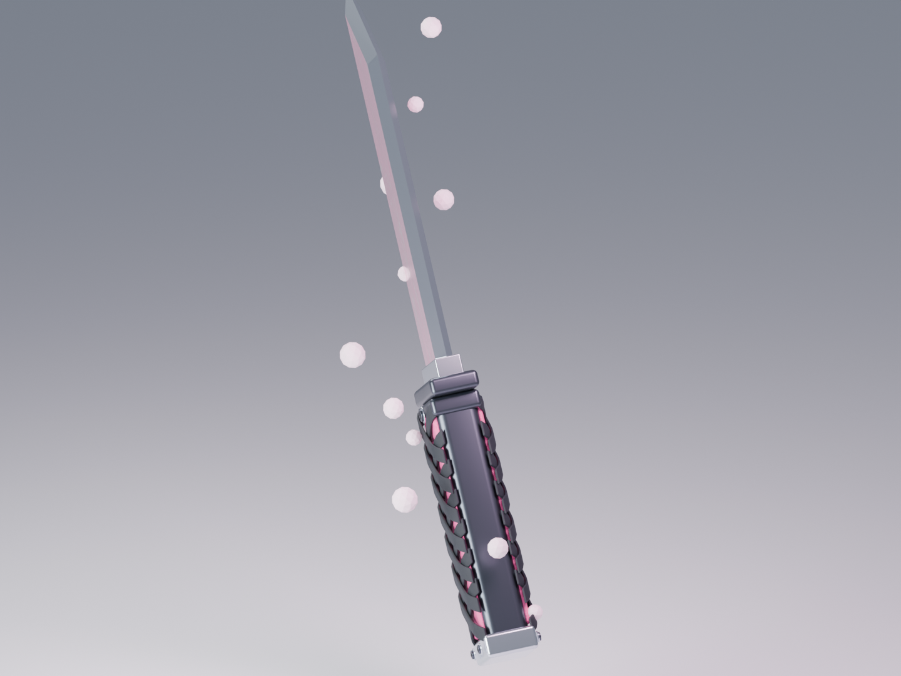
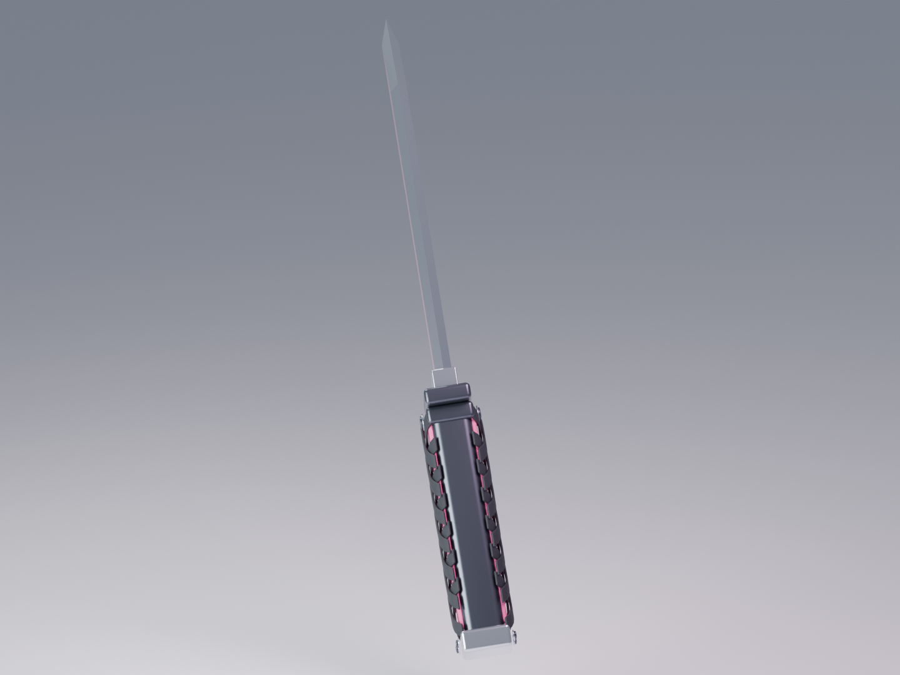

# Projekt Munkanapló: Counter-Strike 2 "Ködpenge"

**Készítette:** Szabó Dávid
**Kijelentés a munkafolyamatról:** A projekt teljes egésze 100%-ban manuális munkával, a Blender grafikus felületén (GUI) készült. A modellezés, a csomópont-alapú (Node) textúrázás, az anyagok rétegzése és a kulcskockás animáció során semmilyen scriptet, Python kódot vagy automatizáló add-on-t nem használtam.

## I. Fázis: Modellezés és Alapok (Július 1. – Július 15.)

**1. Jelenet és arányok előkészítése (Július 1-2.)**
*   A render motort Cycles-re állítottam, 64 mintavétellel (samples) és aktív Denoising (OIDN) beállítással. A kimeneti felbontást 1440x1080-ra lőttem be (24 FPS).
*   A World beállításoknál egy világos, stúdiójellegű hűvös hátteret kevertem ki (RGB: 0.65, 0.72, 0.85), 0.35-ös erősséggel. Létrehoztam egy 200x200 méteres stúdió talajt.
*   **Ráfordított idő:** 4 óra

**2. Penge és főbb fémrészek (Blockout) (Július 3-6.)**
*   Egy Cube-ból kiindulva extrudálásokkal alakítottam ki az egyenes gerincű, ferdén metszett Tanto formát. Az éleket manuálisan toltam be (inset) a Z-tengelyen, hogy kialakuljon a vágóél profilja.
*   Primitívekből (Box/Cylinder) kifaragtam az ezüst pengegallért (0.91 x 0.255 x 0.2 m), a kézvédőt, a markolat belső testét és a felső gyűrűt, valamint az ezüst markolatvéget.
*   **Ráfordított idő:** 18 óra

**3. Komplex markolat és topológia finomítás (Július 7-11.)**
*   A markolatot körbeölelő átlós pántokat egyenként modelleztem le. Létrehoztam 14 db vékony szalagot (oldalanként és irányonként 7-7 darabot). Minden szalagot 13 kontrollpont manuális mozgatásával hajlítottam rá a markolatra.
*   A szalagokra Solidify modifiert (0.025 vastagság) és Bevel modifiert (0.009, 2 szegmens) alkalmaztam.
*   Hengerből modelleztem csavarokat és alátéteket (0.064 sugár). A csavarfejekbe manuálisan belevágtam a sötét kereszt-hornyokat, és beforgattam őket.
*   **Ráfordított idő:** 35 óra

**4. Élek tisztítása (Július 12-15.)**
*   Minden hard-surface elemen (penge, markolat, gallérok) manuálisan beállítottam a Bevel értékeket (0.015 - 0.045 között).
*   Minden ilyen objektumra rákerült egy Weighted Normal modifier a tökéletes simítási hibák elkerülése végett.
*   Létrehoztam egy központi Empty objektumot (`KES | forgasvezerlo`), és minden alkatrészt ehhez rendeltem (parenting).
*   **Ráfordított idő:** 12 óra

---

## II. Fázis: Procedurális Textúrázás UV nélkül (Július 16. – Augusztus 5.)

Mivel a textúrák nem feszülhettek rá a hálóra, UV nyitás helyett tisztán procedurális, Object-koordinátájú csomópont (Node) hálózatokat építettem manuálisan a Shader Editorban.

**1. Alapanyagok felépítése (Július 16-20.)**
*   **Polírozott ezüst:** Metallic 0.95, Roughness 0.21. Ezt a penge éléhez és a csavarokhoz rendeltem.
*   **Szürke fém (Gunmetal):** Sötétebb (RGB: 0.09, 0.105, 0.13), Metallic 0.85, Roughness 0.3.
*   **Markolatbetét (Rózsaszín):** Érdesített, sötét rózsaszín (Metallic 0.12, Roughness 0.42). Létrehoztam egy zaj-alapú (Noise scale 105) Bump mapet a felület rücskösségéhez.
*   **Fekete bandázs:** Matt szövetanyag (Metallic 0.02, Roughness 0.63). Szintén kapott egy mikroszkopikus Noise Bump mapet (Scale 155, Strength 0.38).
*   **Ráfordított idő:** 16 óra

**2. A "Ködpenge" komplex anyagának kifejlesztése (Július 21-30.)**
Három térbeli szintet futtattam egymásra a penge saját objektum-terében.
*   **1. Szint (Nagy örvénylés):** Noise Texture (Scale 1.7, Detail 3). Ezt egy Vector Math node-dal lekicsinyítettem (0.55).
*   **2. Szint (Belső szerkezet):** Az első szint kimenetét hozzáadtam egy újabb Noise textúrához (Scale 3.6, Detail 4), majd lekicsinyítettem (0.3).
*   **3. Szint (Részletek):** Egy harmadik Noise Texture (Scale 6.5, Distortion 1.15) adta meg a végső formát.
*   **Színbeállítás:** A végeredményt egy ColorRamp node-ba kötöttem, ahol manuálisan felvettem a kulcsszíneket: 26%-nál élénk rózsaszín, 44% és 56%-nál halvány rózsaszín, 68%-nál tiszta fehér, 86%-nál "jég" szín.
*   **Anyag fizika:** A Principled BSDF-en beállítottam 0.68 Metallic értéket, 0.6 Anisotropic (szálcsiszolt fém) és 0.45 Coat (lakkréteg) hatást.
*   Egy ShaderNodeMix segítségével a penge élénél lévő részeket átlátszóan összemosom az ezüst anyaggal (Factor 0.4).
*   **Ráfordított idő:** 40 óra

**3. Finomhangolás és statikus véglegesítés (Július 31. – Augusztus 5.)**
*   A penge felületére egy negyedik zajtextúrával (Scale 40) finom csiszolási karcokat (Bump, Distance 0.003) húztam.
*   Ellenőriztem, hogy a textúra térben mozogva megfelelően "folyik-e" a penge testén.
*   **Ráfordított idő:** 15 óra

---

## III. Fázis: Animáció és Prezentáció (Szeptember)

A statikus modellből egy látványos bemutató készült a Dope Sheet és a Graph Editor használatával, szigorúan manuális kulcskockázással.

**1. Felütés animáció (Szeptember 1-5.)**
*   A Dope Sheet-en manuálisan eltoltam (offset) az egyes alkatrészek kulcskockáit, hogy egymás után, késleltetve essenek a helyükre. A Graph Editorban az interpolációt "Ease Out" görbére húztam, hogy a becsapódás finom legyen (1-30. képkocka).
*   Visszamentem az 1. képkockára, az összes alkatrészt a Z-tengelyen felemeltem +2.4 méterrel, a Scale-t pedig 35%-ra vettem le.
*   **Ráfordított idő:** 25 óra

**2. Kamera és Lebegés/Forgás animáció (Szeptember 6-10.)**
*   Hozzáadtam egy Orthographic kamerát, merőlegesen lefelé nézve a késre (Z: 2.8m). Animáltam a zoomot és a kamera követését a modell dőléséhez.
*   A `forgasvezerlo` Empty objektumot kulcskockákon a Z tengelyen fel-le mozgattam (0.0 és 0.55m között), és különböző szögben megdöntöttem (Pitch: -4 és +6 fok között).
*   Létrehoztam egy egyenletes (Linear) 360 fokos forgást a Z tengely körül a teljes 12 másodperc alatt.
*   **Ráfordított idő:** 18 óra

**3. Világítás animálása (Szeptember 11-14.)**
*   Manuálisan beállítottam 3 Area Light-ot kör alakban (Nagy lágy főfény, Első derítés, Rózsaszín peremfény).
*   A lámpák erejét (Energy) kulcskockáztam, hogy a forgás közben a fények pulzáljanak (pl. a főfény 900W-ról 1400W-ra erősödik a 100. képkockánál, majd visszahalványul). Ezzel emeltem ki a textúra PBR tulajdonságait.
*   **Ráfordított idő:** 12 óra

**4. Ködfüst részecskék kézi animálása (Szeptember 15-20.)**
*   Létrehoztam egy `Kodfust` kollekciót 12 darab Icosphere-ből, amelyek világító (Emission), félig áttetsző rózsaszín anyagot (Strength 0.45) kaptak.
*   Mind a 12 gömböt egyenként pozicionáltam a kés köré. A 12 másodperces idővonalon manuálisan kulcskockáztam be a keringésüket, a Z-tengelyes liftezésüket és a méretük (Scale) pulzálását.
*   **Ráfordított idő:** 30 óra

**5. Végső ellenőrzés és Renderelés (Szeptember 21-23.)**
*   A Graph Editor utolsó átnézése, az ease-in és ease-out görbék finomítása.
*   A felesleges anyagok és teszt-modellek kitörlése a jelenetből.
*   A 288 képkocka kirenderelése PNG formátumban.
*   **Ráfordított idő:** 8 óra

